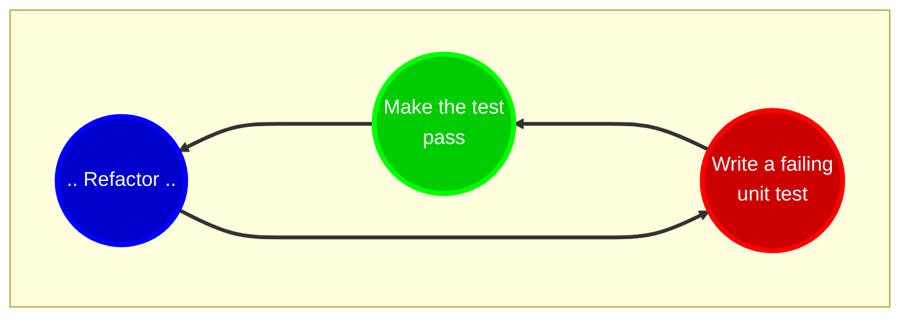
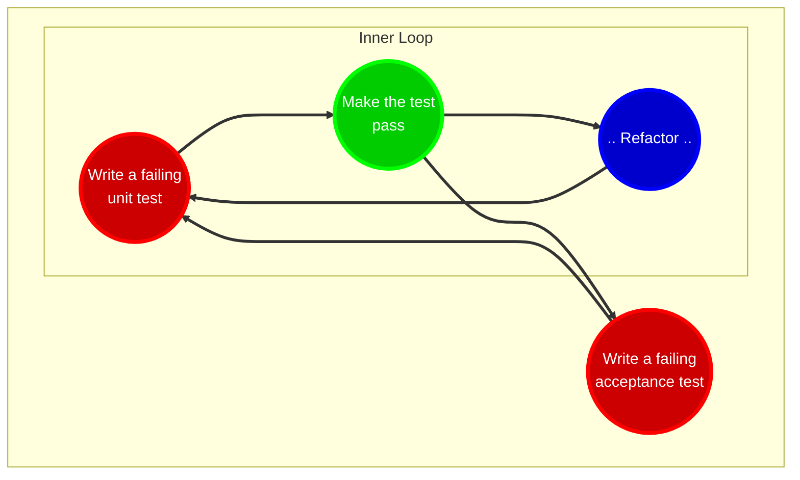

# Styles of Test Driven Development

Generally, there are considered to be two styles of test driven development.

1. Classicist TDD. Also known as the Chicago or Detroit school of TDD. In this school, unit tests perform state verification.
2. Outside-in TDD. Also known as the London school of TDD or Mockist TDD. In this school, unit tests perform behaviour verification.

## Classicist TDD

TDD was popularized by [Kent Beck](https://en.wikipedia.org/wiki/Kent_Beck) in the 2002 book [ Test-driven Development By Example](https://www.amazon.co.uk/Test-Driven-Development-Addison-Wesley-Signature/dp/0321146530). 

In the book, Kent quotes [Ron Jeffries](https://en.wikipedia.org/wiki/Ron_Jeffries) who states that the goal of TDD is to create `clean code that works`. Kent suggests that TDD can achieve this if we follow two simple rules:

1. Only write new code to fix a failed [unit test](https://martinfowler.com/articles/practical-test-pyramid.html#UnitTests).
2. When all tests are working, eliminate duplication.

These rules lead to a three step process for writing code:

1. Write a failing test. A failing test is one that either causes the code fail compilation or that throws an exception. All newly written tests should fail and should fail in the expected way. The code is now in the `red` state (so called because testing tools/error messages are displayed in red).
2. Write the *minimal* amount of code to stop the test failing. The code is now in the `green` state (so called because testing tools display in success i.e., zero teat failures, as green).
3. Eliminate any duplication created in step 2 by *refactoring* the code *without changing its behaviour*.



To provide fast feedback to the developer(s) writing the code, the tests must run *quickly* - the faster we can iterate around this loop, the faster we can validate assumptions, capture edge cases, and improve the design.  

The Classicist style of TDD uses state based verification i.e., the subject under test will be acted upon and assertions will be used to verify the state of the object. The example below, written in C# and using the xUnit testing framework, shows a simple state based verification test: 

```csharp
public class StackShould
{
    [Fact]
    public ContainOneItemAfterItemPushed()
    {
        var stack = new Stack<int>();
        stack.Push(42);
        Assert.Equal(1, stack.Count); // State verification
    }
} 
```

Because of the focus on state based verification, systems designed using Classist TDD tests must be build from the inside-out. Tests start with the lowest level objects and build outwards. Higher level abstractions are then composed of fully tested lower level layers and this continues until we reach the final user/feature layer. The design of systems built in this way *emerges* from the TDD process. Typically, emergent design happens in the refactoring phased - where working code is improved and duplication is removed.    

## Outside-in TDD 

Several questions arise when using pure Classicist TDD:
- Where do I start?
- When do I stop?
- Do I need this code?
- Can this code be integrated with other code in the system?

In [Growing object-oriented software, guided by tests](https://www.amazon.co.uk/Growing-Object-Oriented-Software-Guided-Signature/dp/0321503627), [Steve Freeman](https://www.amazon.co.uk/Steve-Freeman/e/B002O21DQW) and [Nat Pryce](https://www.amazon.co.uk/Nat-Pryce/e/B002PXWFIU) address these issues by using the golden rule of TDD: *write a failing test*. They suggest the best place to start when adding a new *feature* to an application (including the first feature) is to write a failing *acceptance* test.  

Here a *feature* can be a [user story](https://en.wikipedia.org/wiki/User_story) or some other high level piece of functionality and an *acceptance* test is a test conducted to determine if the requirements of a feature are met.  

The combination of acceptance and unit testing leads to a double loop


Because Outside-in TDD starts with an acceptance test, you need to do a small amount of up-front design first to define the public interface and *collaborators* of the system under test. Collaborators can then be *mocked* to implement the acceptance test. As collaborators are mocked, tests must use behaviour verification. 

For example, consider the "forgot password" process for a typical web site. The acceptance test for this functionality might state "given a user has registered with their email address when the user requests a password reset then an email with a reset link will be sent". 

If we were to implement this using ASP.NET MVC, a ```PasswordResetController``` would be responsible for handling the interaction with the user. During our up-front design we may decide that we need a ```IUserAuthenticatorService``` to check if the ```UserIsRegistered``` and a ```IPasswordResetEmailerService``` to send the email. The code below, written in C# using xUnit and the NSubstitute mocking framework, shows a simple behaviour based verification test for this design:   

```csharp
public class PasswordResetControllerShould
{
    private const string RegisteredUserEmail = "registered.user@example.com";
    private IUserAuthenticatorService userAuthenticatorService = Substitute.For<IUserAuthenticatorService>();
    private IPasswordResetEmailerService passwordResetEmailerService = Substitute.For<IPasswordResetEmailerService>();

    [Fact]
    public void SendEmailIfUserIsRegistered()
    {
        userAuthenticatorService.UserIsRegistered(RegisteredUserEmail).Returns(true); // Setup
        var controller = new PasswordResetController(userAuthenticatorService, passwordResetEmailerService);
        
        var result = controller.Reset(RegisteredUserEmail);

        passwordResetEmailerService.Received().SendPasswordReset(RegisteredUserEmail); // Verify behaviour
    }
} 
```

## Classist TDD and Mocking

Mocking is used heavily in Outside-in TDD but can also in the Classist style of TDD.
Page 144 of [Test-driven Development By Example](https://www.amazon.co.uk/Test-Driven-Development-Addison-Wesley-Signature/dp/0321146530) contains a discussion about using mocks to test an object that relies on an expensive and complex resources. 


## A Brief History of Names

The Classicist style evolved from the [XP](https://en.wikipedia.org/wiki/Extreme_programming) practices developed by [Kent Beck](https://en.wikipedia.org/wiki/Kent_Beck) during his work on the [C3 payroll project](https://en.wikipedia.org/wiki/Chrysler_Comprehensive_Compensation_System) for Chrysler in 1996. As Chrysler where based in Detroit, Michigan [at the time](https://en.wikipedia.org/wiki/Chrysler#1925%E2%80%931998:_Chrysler_Corporation) the Classicist style is sometimes referred to as ```Detroit style```. 

The Classicist style is also called the ```Chicago style``` of TDD due to its association with [ThoughtWorks](https://en.wikipedia.org/wiki/Thoughtworks) whose head offices are based in Chicago, Illinois.  

 Based on Google search results, the ```Chicago style``` naming seems more prevalent than  the ```Detroit style``` naming. 

In the beginning, the Classicist style of TDD was just called TDD - it was the only style and therefore did not need to be distinguished from any other style.

The ```Classicist``` term was introduced to differentiate the Classicist style from the new ```Outside-in``` style of TDD. 

The Outside-in style evolved out of ideas discussed at the [Extreme Tuesday club](https://www.extremetuesday.com/) - a meetup/community group for Agile, XP, Kanban and Scrum. As the group is based in London, the Outside-in style is sometimes referred to as the ```London style``` 


## Which style should I use?

Now that we understand the differences between the two major schools of TDD we might ask: which style should I use?

The answer, as with many things in software engineering and architecture, is *it depends*.

Personally, I believe any non-trivial codebase will benefit from starting with an Outside-in approach. However, it should be noted that the two styles are not mutually exclusive. Once we reach the lowest level of components within the system the tests will start to look more like tests written in the Classist style due to the lack of collaborators. 
