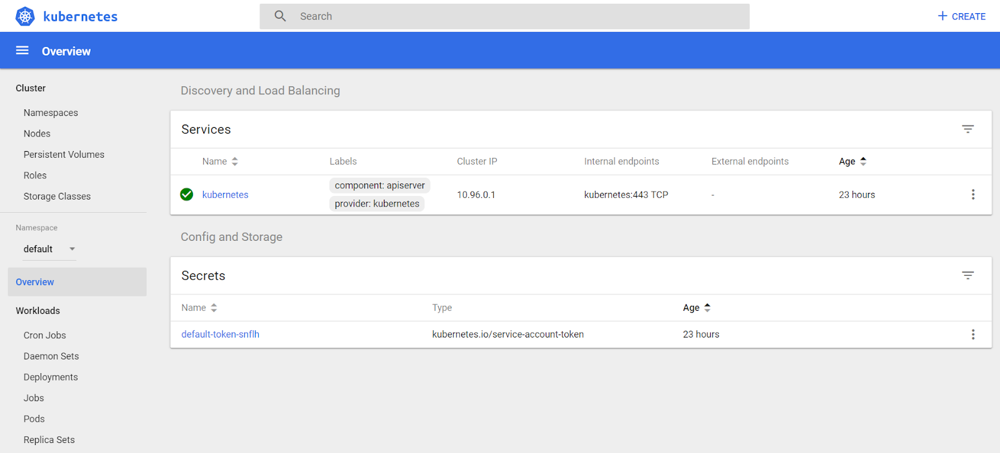

# Useful minikube commands

Minikube is a tool that makes it easy to run Kubernetes locally for development purposes. On Windows, minikube runs a single-node Kubernetes cluster inside a Virtual Machine running on Virtualbox or Hyper-V.

If you do not have minikube installed you can follow my guide on Setting up minikube on [Windows 10 Home edition](setting-up-minikube-on-windows-10.md).

This post contains a list of useful minikube commands:

```minikube start``` - starts the local Kubernetes instance running inside the host. This command can take a few minutes to start up the VM and Kubernetes cluster fully. Once completed the message "Done! kubectl is now configured to use minikube" should be displayed in the console window.

```minikube stop``` - stops the local Kubernetes instance and shuts down the host VM.

```minikube status``` - gets the status of the current minikube status and also indicates whether it is running or not.

```minikube dashboard``` - runs the K8S dashboard and launches a new browser window to allow you to view the dashboard. This is the easiest way to launch the dashboard (since other methods such as kubectl proxy make the dashboard accessible but do not automatically open a browser window)



The dashboard will continue to run until you press CTRL+C.
