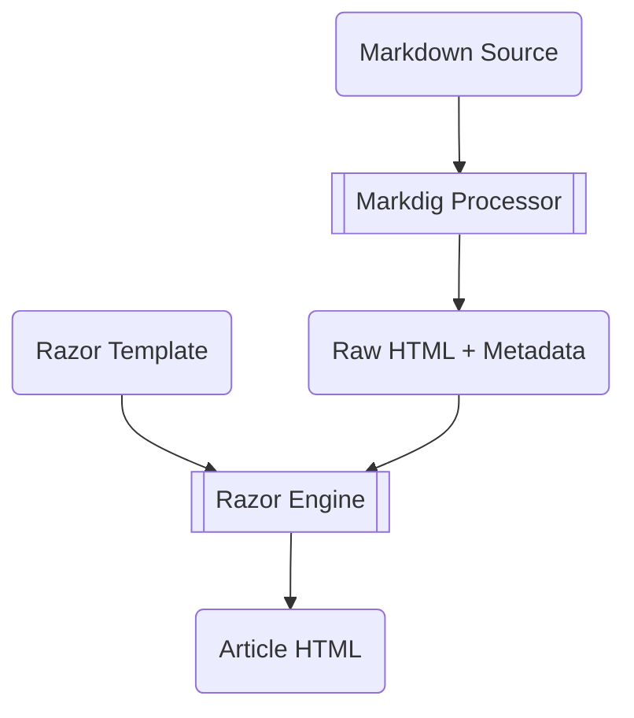

# Generating a Static Website Using Markdown

In my [Blogging with GitHub and Markdown](blogging-with-github-and-markdown.md) article, I discussed using Markdown to author content for your blog. In this follow up article, I will use C#, [Markdig](https://github.com/xoofx/markdig), and [RazorEngine.NetCore](https://github.com/fouadmess/RazorEngine) to convert the Markdown content to HTML so that it can be published on to the Internet.

The diagram below outlines how a raw Markdown source files are processed:



Here we can see:

1. The Markdig processor parses the raw Markdown source file, extracts and Yaml metadata, and converts the remaining Markdown to HTML
1. The raw HTML and metadata are then processed by the Razor Engine which embeds the article into a Rasor template.

## Markdig - the Markdown engine

The basic process for converting the Markdown into a model that can be passed to the Razor engine is shown in the C# code snippets below:

```csharp
// Create a processing pipeline
var pipeline = new MarkdownPipelineBuilder()
                .UseBootstrap()
                .UseYamlFrontMatter()
                .UseAdvancedExtensions()
                .UsePrism()
                .Build();

// Load source from file
var markdownSource = File.ReadAllText("Article.md");

// Convert the markdownSource source string to a document object
MarkdownDocument document = MarkdownParser.Parse(markdownSource, this.pipeline);

// Rewrite links
foreach (var descendant in document.Descendants())
{
    switch (descendant)
    {
        case LinkInline link when link.Url != null && !link.Url.StartsWith("http"):
            // Internal links to other markdown documents
            link.Url = link.Url.Replace(".md", ".html");
            break;
        case AutolinkInline:
        case LinkInline:
            // External links open in new window
            descendant.GetAttributes().AddPropertyIfNotExist("target", "_blank");
            break;
    }
}

// Create an article view model to be passed to the template
var model = new ArticleModel(); 
model.Content = document.ToHtml(this.pipeline);
```

## Razor Engine - the template processor

The basic process for processing the ```ArticleModel``` and creating the output text is shown in the C# code snippets below:

```csharp
var config = new TemplateServiceConfiguration();
var razorEngineService = RazorEngineService.Create(config);
razorEngineService.Compile(templateKey, typeof(ArticleModel));
var templateOutput = razorEngineService.Run(templateKey, typeof(ArticleModel), model, viewBag);
```

All that we need to do now is save the template output as a HTML file.

## Putting it all together

A full working solution that expands on these topics and shows how to put all these components together is available on my [GitHub Blog Project](https://github.com/LeeSanderson/Blog).

## Next Steps
So, you have started your blog, you have written a number of articles, and you are generating content. The next step is to [publish your website](deploying-to-github-pages.md)